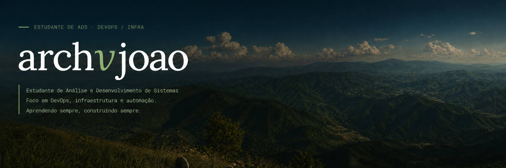

   

## `01` · sobre mim

Sou estudante de **Análise e Desenvolvimento de Sistemas na Fatec Mococa**, iniciando minha carreira em TI com foco em **DevOps e infraestrutura**.

Estou construindo uma base sólida em cultura DevOps, automação, infraestrutura como código e observabilidade. Meu ambiente de estudos é **terminal-first**, utilizando **Fedora 44**, com uma rotina aproximada de **11,5 horas de estudo por semana**.

Meu objetivo é aprender de forma prática, documentar minha evolução e transformar cada etapa dos estudos em conhecimento aplicável.

## `02` · formação

| Formação | Status |
| --- | --- |
| **Análise e Desenvolvimento de Sistemas — Fatec Mococa** | Em andamento |
| **Formação DevOps — Rocketseat** | Em andamento |

A graduação contribui para minha base em desenvolvimento e tecnologia, enquanto a Formação DevOps complementa meus estudos com práticas relacionadas a ambientes, automação, containers e entrega de software.

## `03` · stack

### Conhecimentos atuais

  
  
  
  
  
  

### Em aprendizado

  
  
  
  

## `04` · trilha de estudos

| Nível | Foco | Tecnologias | Status |
| --- | --- | --- | --- |
| **01** | Fundamentos + Docker | Linux, Docker, Docker Compose, Git | **Em andamento** |
| **02** | Infraestrutura como código | Terraform, Azure | **Não iniciado** |
| **03** | CI/CD | GitHub Actions | **Não iniciado** |
| **04** | Orquestração | Kubernetes | **Não iniciado** |
| **05** | Observabilidade | Logs, métricas e alertas | **Não iniciado** |

  aprendendo sempre · construindo sempre · documentando o caminho

